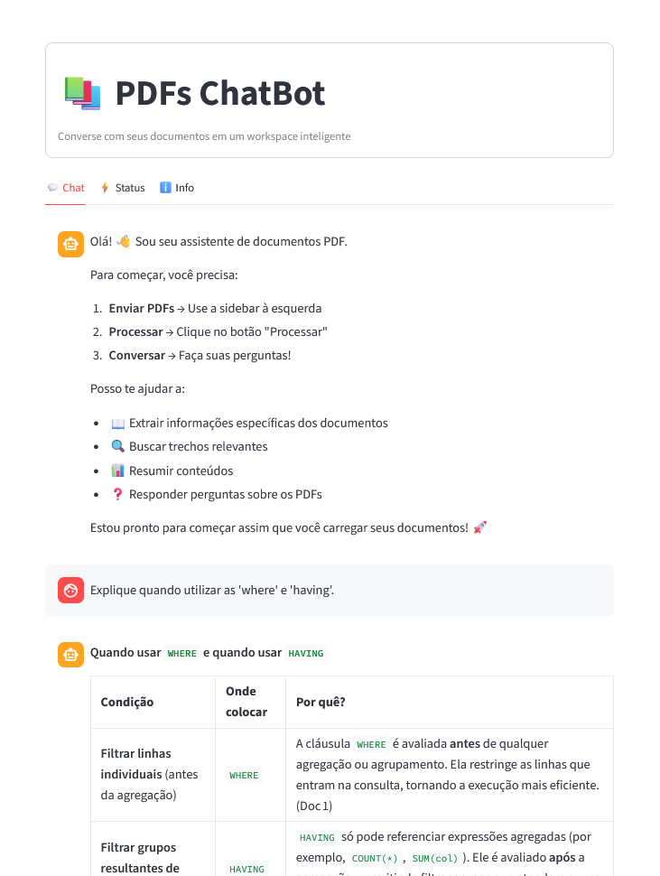

# RAG PDF Assistant

Sistema de conversação inteligente com documentos PDF utilizando Retrieval-Augmented Generation (RAG). O projeto combina busca semântica vetorial (FAISS) com Large Language Models (via Groq API) para fornecer respostas contextualizadas, precisas e estritamente baseadas nos documentos fornecidos.



## Visão Geral

O RAG PDF Assistant foi projetado para resolver o problema de alucinação em LLMs ao restringir o contexto de resposta aos documentos carregados pelo usuário. A aplicação utiliza uma arquitetura híbrida que mantém o estado da conversação e realiza buscas vetoriais em tempo real, oferecendo uma experiência de chat fluida com streaming de tokens.

### Funcionalidades Principais

*   **Ingestão Multi-Documento:** Processamento simultâneo de múltiplos arquivos PDF com barra de progresso.
*   **Indexação Persistente:** Os índices vetoriais (FAISS) são salvos em disco, eliminando a necessidade de reprocessamento entre sessões.
*   **Busca Semântica Híbrida:** Algoritmo de retrieval que busca e ranqueia fragmentos (chunks) de todos os documentos carregados baseando-se em similaridade e relevância.
*   **Contextualização (LCEL):** Utiliza *LangChain Expression Language* para reformular perguntas com base no histórico do chat.
*   **Streaming em Tempo Real:** Geração de respostas token a token para menor latência percebida.
*   **Painel de Controle Dinâmico:** Ajuste fino de hiperparâmetros (Temperatura, Top-K, Max Tokens) em tempo de execução.
*   **Exportação de Dados:** Funcionalidade para baixar o histórico completo da sessão e métricas de performance em JSON.

## Arquitetura do Sistema

O projeto segue o padrão MVC (Model-View-Controller) adaptado para aplicações de dados:

```text
RAG-PDF-Assistant/
├── assets/              # Recursos estáticos
├── docs/                # Documentações
├── indices/             # Persistência vetorial (FAISS)
├── notebooks/           # Notebooks utilizados para construção da classe ChatBot
├── src/
│   ├── app.py           # Frontend (Streamlit) - Controller & View
│   └── chatbot.py       # Backend (LangChain) - Model & Business Logic
├── temp_uploads/        # Área de staging para processamento
├── .env                 # Configuração de ambiente
├── pyproject.toml       # Dependências (uv)
└── README.md            # Documentação
```

### Componentes

1.  **Frontend (`src/app.py`):** Gerencia o ciclo de vida da sessão (`st.session_state`), interface de upload, renderização do chat e feedback visual das fontes consultadas.
2.  **Backend (`src/chatbot.py`):** Encapsula a lógica de RAG. Gerencia a conexão com a API da Groq, a criação/carregamento de índices FAISS e a execução das chains de conversação.

## Stack Tecnológica

*   **Linguagem:** Python 3.10+
*   **Orquestração:** LangChain (Core & Community)
*   **Interface:** Streamlit
*   **LLM Inference:** Groq API
*   **Vector Store:** FAISS (CPU)
*   **Embeddings:** HuggingFace (`sentence-transformers/all-MiniLM-L6-v2`)
*   **Gerenciamento de Pacotes:** uv

### Modelos Suportados

A aplicação suporta nativamente os seguintes modelos via Groq:
*   `llama-3.3-70b-versatile` 
*   `llama-3.1-8b-instant` 
*   `kimi-k2`
*   `gpt-oss-20b`
*   `qwen3-32b`

## Instalação e Configuração

Este projeto utiliza o **uv** para gerenciamento de dependências e ambientes virtuais, garantindo instalações rápidas e reprodutíveis.

### 1. Clonar o Repositório

```bash
git clone https://github.com/esscova/RAG-PDF-Assistant.git
cd RAG-PDF-Assistant
```

### 2. Instalar Dependências

Execute o comando abaixo para criar o ambiente virtual e sincronizar as dependências definidas no `pyproject.toml`:

```bash
uv sync
```

### 3. Configurar Variáveis de Ambiente
_Para uso CLI_

Crie um arquivo `.env` na raiz do projeto e adicione sua chave de API da Groq:

```env
GROQ_API_KEY=gsk_sua_chave_aqui...
```

## Utilização

Para iniciar a aplicação, utilize o `uv` para garantir que o script rode no ambiente virtual correto:

```bash
uv run streamlit run src/app.py
```

A interface estará disponível em `http://localhost:8501`.

### Fluxo de Trabalho

1.  **Autenticação:** Insira sua API Key na tela inicial.
2.  **Upload:** Carregue seus arquivos PDF através da barra lateral.
3.  **Processamento:** Clique em "Processar". O sistema criará (ou carregará) os índices vetoriais.
4.  **Interação:** Utilize o chat para fazer perguntas. O sistema citará as fontes (Nome do arquivo e Página) para cada afirmação.

## Configuração Avançada

Os seguintes parâmetros podem ser ajustados via interface ou código:

| Parâmetro | Padrão | Descrição |
| :--- | :--- | :--- |
| **Temperature** | `0.1` | Controla a criatividade. Valores baixos favorecem precisão factual. |
| **Max Tokens** | `2048` | Limite de tamanho da resposta gerada. |
| **Retriever K** | `4` | Número de trechos de documentos recuperados por pergunta. |
| **Fetch K** | `8` | Número de candidatos iniciais antes da reordenação (MMR). |
| **Chunk Size** | `1000` | Tamanho dos blocos de texto para indexação. |

## Estrutura de Exportação

O sistema permite exportar o histórico em JSON com a seguinte estrutura:

```json
{
  "exported_at": "2026-02-11T10:30:00",
  "stats": {
    "queries": 12,
    "last_query_time": 1.45
  },
  "messages": [
    {
      "role": "user",
      "content": "Qual o faturamento da empresa?"
    },
    {
      "role": "assistant",
      "content": "O faturamento foi de R$ 10M...",
      "sources": [
        {
          "source_file": "relatorio_2025.pdf",
          "page": 12,
          "score": 0.45
        }
      ]
    }
  ]
}
```

## Licença

Distribuído sob a licença MIT. Veja `LICENSE` para mais informações.

---

**Autor:** Wellington M Santos

**Linkedin:** [in/wellington-moreira-santos](https://www.linkedin.com/in/wellington-moreira-santos/)