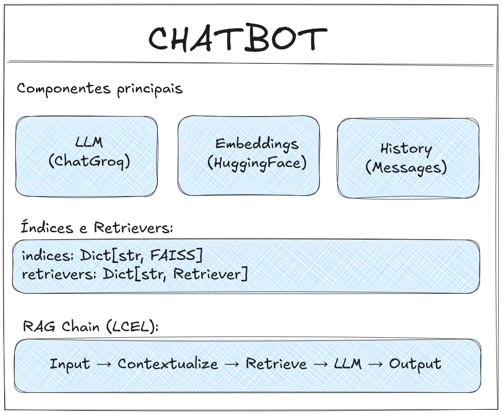

# Documentação do Módulo chatbot.py

## Visão Geral
O Módulo `chatbot.py` implementa a lógica de backend do sistema RAG (Retrieval Augmented Generation) para conversação com documentos PDFs.

**Autor:** Wellington M. Santos

**Data:** Fevereiro/2026

---

## Arquitetura

### Diagrama de Componentes

### Princípios de Design
1. **Lazy Loading**: Índices são carregados do disco quando existentes, criados apenas quando necessário.
2. **Configuração Dinâmica**: Parâmetros podem ser alterados em runtime com recriação seletiva de componentes.
3. **Persistência Automática**: Índices FAISS são salvos automaticamente em disco.
4. **Modo RAG Estrito**: Respostas baseadas exclusivamente no documentos fornecidos.
5. **Busca Híbrida**: Combina resultados de múltiplos índices com ranking global.

---
