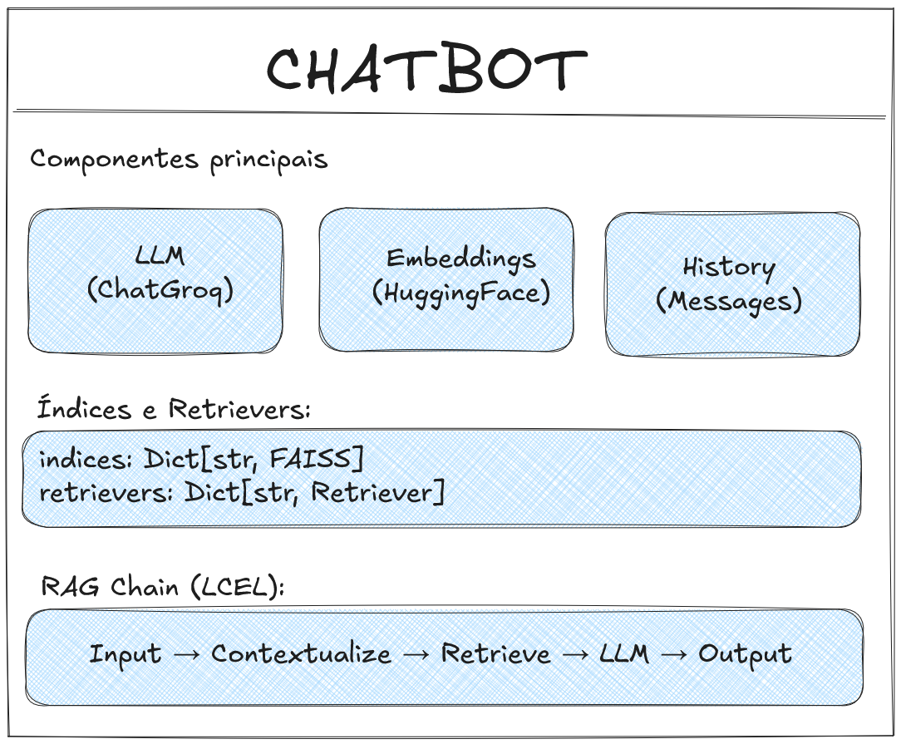

# Documentação do Módulo chatbot.py

## Visão Geral
O Módulo `chatbot.py` implementa a lógica de backend do sistema RAG (Retrieval Augmented Generation) para conversação com documentos PDFs.

**Autor:** Wellington M. Santos

**Data:** Fevereiro/2026


## Arquitetura
---
### Diagrama de Componentes


### Princípios de Design
1. **Lazy Loading**: Índices são carregados do disco quando existentes, criados apenas quando necessário.
2. **Configuração Dinâmica**: Parâmetros podem ser alterados em runtime com recriação seletiva de componentes.
3. **Persistência Automática**: Índices FAISS são salvos automaticamente em disco.
4. **Modo RAG Estrito**: Respostas baseadas exclusivamente no documentos fornecidos.
5. **Busca Híbrida**: Combina resultados de múltiplos índices com ranking global.

## Dependências
---
### Bibliotecas Core
```python
import os
import time
import shutil
from pathlib import Path
from dotenv import load_dotenv
from typing import Dict, Any, List, Union
from datetime import datetime
import json
import logging
import unicodedata
import re
```

### Langchain Ecosystem
```python
# LLM provider
from langchain_groq import ChatGroq

# core componentes
from langchain_core.messages import HumanMessage, AIMessage, SystemMessage
from langchain_core.documents import Document
from langchain_core.prompts import ChatPromptTemplate, MessagesPlaceholder
from langchain_core.output_parsers import StrOutputParser
from langchain_core.runnables import RunnablePassthough

# document processing & storage
from lanchain_community.document_loaders import PyMuPDFLoader
from langchain_community.vectorstores import FAISS

# embeddings & text processing
from langchain_huggingface import HuggingFaceEmbeddings
from langchain_text_splitters import RecursiveCharacterTextSplitter
```

## Configurações
---

### Modelos Groq Disponíveis
```python
GROQ_MODELS = {
    "llama-3.3-70b": "llama-3.3-70b-versatile",
    "llama-3.1-8b": "llama-3.1-8b-instant",
    "kimi-k2": "moonshotai/kimi-k2-instruct",
    "gpt-oss-20b": "openai/gpt-oss-20b",
    "qwen3-32b": "qwen/qwen3-32b"
}
```

### Configuração Padrão
```python
DEFAULT_CONFIG = {
    "model": "llama-3.1-8b-instant",
    "temperature": 0.1,
    "max_tokens": 2048,
    "chunk_size": 1000,
    "chunk_overlap": 200,
    "embeddings_model": "sentence-transformers/all-MiniLM-L6-v2",
    "retriever_k": 3,
    "retriever_fetch_k": 5,
    "max_history_messages": 10,
    "index_dir": "indices",
}
```
### Grupos de Dependência
Configurações são agrupadas por componentes que afetam:
```python
LLM_DEPENDENT = ['model', 'temperature', 'max_tokens']
RETRIEVER_DEPENDENT = ['retriever_k', 'retriever_fetch_k']
EMBEDDING_DEPENDENT = ['embeddings_model', 'chunk_size', 'chunk_overlap']
```
*Mudanças em `EMBEDDING_DEPENDENT` requerem reindexação de todos os documentos.

## Classe ChatBot
---

### Inicialização
```python
class ChatBot:
    """
    ChatBot com Lazy Loading e Configuração Dinâmica.
    
    Implementa um sistema RAG completo para conversação com documentos PDF,
    com suporte a múltiplos documentos, persistência de índices e streaming
    de respostas.
    """
    
    def __init__(self, config: Dict[str, Any] = None, api_key: str = None):
        """
        Inicializa o ChatBot.
        
        Args:
            config: Dicionário com configurações customizadas. Se None, usa DEFAULT_CONFIG
            api_key: Chave API do Groq. Se None, tenta carregar de GROQ_API_KEY env var
        
        Raises:
            ValueError: Se GROQ_API_KEY não estiver configurada
        
        Attributes:
            config (dict): Configurações ativas
            api_key (str): Chave API do Groq
            llm (ChatGroq): Instância do modelo de linguagem
            embeddings (HuggingFaceEmbeddings): Modelo de embeddings
            history (List): Histórico de mensagens (SystemMessage, HumanMessage, AIMessage)
            last_sources (List[Document]): Últimas fontes recuperadas
            indices (Dict[str, FAISS]): Índices FAISS por nome de documento
            retrievers (Dict[str, Retriever]): Retrievers por nome de documento
            rag_chain: Chain LCEL para processamento RAG
        """
```
### Atributos de instância

Aqui está o texto selecionado formatado como uma tabela Markdown:


Atributos de Instância


| Atributo      | Tipo                        | Descrição                              |
|---------------|-----------------------------|----------------------------------------|
| config        | Dict[str, Any]              | Configurações ativas do chatbot        |
| api_key       | str                         | Chave API do Groq                      |
| llm           | ChatGroq                    | Instância do modelo de linguagem       |
| embeddings    | HuggingFaceEmbeddings       | Modelo de embeddings                   |
| history       | List[Message]               | Histórico de conversação               |
| last_sources  | List[Document]              | Últimas fontes consultadas             |
| indices       | Dict[str, FAISS]            | Índices vetoriais por documento        |
| retrievers    | Dict[str, Retriever]        | Retrievers configurados                |
| rag_chain     | Runnable                    | Chain LCEL para RAG                    |


